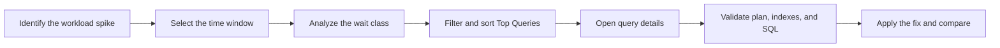

# OCI PostgreSQL Query Insights

[English](./README-oci-postgresql-query-insights.md) | [Português (Brasil)](./README-oci-postgresql-query-insights.pt-BR.md)

<p align="center">
  
</p>

<p align="center">
  <strong>Monitor workload, find bottlenecks, and prioritize PostgreSQL query optimization on OCI.</strong>
</p>

<p align="center">
  
  
  
  
</p>

## Overview

**Query Insights** is the built-in observability feature of OCI Database with PostgreSQL. It helps DBAs and developers understand database workload, identify inefficient queries, and investigate bottlenecks through metrics and visualizations integrated into the OCI Console.

The dashboard helps answer questions such as:

- when workload increased;
- which wait classes dominated the period;
- which queries contributed most to the load;
- whether the issue is related to CPU, I/O, locks, or another resource;
- in which database, instance, or role (`Primary`/`Replica`) a query ran.

> This guide is based on [Welcome to OCI PostgreSQL Query Insights](https://blogs.oracle.com/cloud-infrastructure/oci-postgresql-query-insights), by Arvind Yadav, published on June 22, 2026.

## Contents

- [Key features](#key-features)
- [Prerequisites and access](#prerequisites-and-access)
- [Enabling or disabling Query Insights](#enabling-or-disabling-query-insights)
- [Understanding the dashboard](#understanding-the-dashboard)
- [Average Active Sessions](#average-active-sessions)
- [Top queries analysis](#top-queries-analysis)
- [Practical investigation workflow](#practical-investigation-workflow)
- [Interpreting wait events](#interpreting-wait-events)
- [Best practices](#best-practices)
- [Limitations and behavior](#limitations-and-behavior)
- [References](#references)

## Key features

| Feature | How it helps |
| --- | --- |
| Average Active Sessions (AAS) | Shows workload intensity over time |
| Wait classes | Indicates where sessions spend time during execution |
| Top Queries | Highlights queries contributing most to the load |
| Search and filters | Narrows analysis by query, database, wait, instance, and role |
| Drill-down | Shows wait breakdown for a specific query |
| Sorting | Prioritizes queries by AAS, execution count, or mean execution time |

## Prerequisites and access

Query Insights must be enabled on the OCI PostgreSQL DB System. Access is controlled through IAM:

- users with `write` or `manage` permissions on the DB System can view and use the feature;
- read-only users need the following permission:

```text
POSTGRES_DB_SYSTEM_INSIGHTS_READ
```

Follow the principle of least privilege when adding this permission to an IAM policy, and restrict its scope to the required compartment or resources.

## Enabling or disabling Query Insights

### New DB System

During OCI PostgreSQL DB System provisioning, find the **Query Insights** option in the database settings and enable collection before completing the creation process.

### Existing DB System

In the OCI Console:

1. open **OCI Database with PostgreSQL**;
2. select the desired DB System;
3. open the database settings;
4. change the **Query Insights** state;
5. confirm the change and wait for it to be applied.

> **Warning:** disabling the feature stops collection and removes existing Query Insights data. When it is enabled again, collection starts from that point; the removed history is not recovered.

## Understanding the dashboard

The dashboard has two main areas:

1. **Average Active Sessions over time (wait class):** shows workload over time, grouped by wait class.
2. **Top queries analysis:** lists the queries that contributed most to the observed activity.

Use both views together: first locate the time window and dominant wait type, then identify the responsible queries.



## Average Active Sessions

**Average Active Sessions (AAS)** is the average number of sessions that were running on CPU or waiting for a resource during the observation window.

```text
AAS = total active session time / observation window duration
```

For example, if a query appears in 60 samples collected over 60 seconds, its contribution is `AAS = 1.0`.

Use the chart to:

- compare workload at different times;
- identify spikes or changes in behavior;
- distinguish CPU activity from resource waits;
- correlate database behavior with deployments, jobs, and application traffic.

## Top queries analysis

The **Top Queries** area supports search and filtering by:

| Filter | Recommended use |
| --- | --- |
| Query | Find a SQL pattern or fragment |
| Database name | Isolate workload from a specific database |
| Wait event types | Investigate CPU, I/O, locks, and other waits |
| DB instance ID | Analyze a specific instance |
| Role | Separate activity from the `Primary` and `Replicas` |

Queries can be sorted by:

- **Average Active Sessions:** finds the queries contributing most to workload;
- **Query Count:** highlights frequently executed SQL;
- **Mean Execution Time:** prioritizes slow queries per execution.

When expanding a query, inspect the time distribution by wait type. A query with a high mean execution time may have a different cause from a query executed thousands of times, so tuning should consider total impact, frequency, and user experience.

## Practical investigation workflow

1. Select the time window in which the slowdown was observed.
2. Locate the spike in the AAS chart.
3. Identify the dominant wait class.
4. Filter **Top Queries** by that wait class.
5. Sort by descending AAS.
6. Open the query contributing most to the load.
7. Compare execution count, mean execution time, and wait breakdown.
8. Analyze the execution plan in PostgreSQL:

```sql
EXPLAIN (ANALYZE, BUFFERS)
SELECT ...;
```

> `EXPLAIN ANALYZE` executes the query. Assess the impact before using it in production, especially for data-changing statements or expensive queries.

9. Check indexes, cardinality estimates, reads, joins, and contention.
10. Apply the fix in a controlled way and compare the same workload profile.

## Interpreting wait events

| Class | Common interpretation | First checks |
| --- | --- | --- |
| CPU | Intensive processing, joins, or calculations | Plan, cardinality, indexes, and processed volume |
| IO | Waiting for reads or writes | Large scans, cache, indexes, and storage |
| Lock | Session blocked by another transaction | Blocking sessions, long transactions, and access order |
| LWLock | Internal contention in memory structures | Concurrency, access patterns, and PostgreSQL version |
| Client | Database waiting for the client | Network, application, connection pool, and result consumption |
| IPC | Coordination between processes | Parallelism and worker communication |
| BufferPin | Shared buffer is unavailable | Concurrency on specific pages or objects |
| Timeout | Time-based wait | `pg_sleep`, timeouts, and application behavior |
| Activity / Extension | Internal processes or extensions | Background activity and installed extensions |

A wait class is a clue, not a complete diagnosis. Confirm the hypothesis with the execution plan, DB System metrics, logs, and application context.

## Best practices

- monitor AAS regularly to establish an environment baseline;
- investigate spikes in the context of traffic, deployments, and scheduled tasks;
- prioritize by total impact rather than only by the slowest individual execution;
- correlate wait classes with DB System resources;
- review frequent queries, indexes, and execution plans;
- compare trends over time instead of relying on a single snapshot;
- record the time window, hypothesis, change, and result for each tuning effort;
- complement Query Insights with OCI alarms and notifications.

## Limitations and behavior

According to the reference article:

| Item | Reported behavior |
| --- | --- |
| Retention | Up to 7 days |
| Storage | In the DB System itself, in the `oci_admin` database |
| Additional cost | No additional charge for the feature |
| Re-enabling | Starts a new collection; removed history is not restored |

Cloud service characteristics can change. Confirm current limits, regional availability, and behavior in the official documentation before defining operational processes or audit requirements.

## References

- [Welcome to OCI PostgreSQL Query Insights — OCI Blog](https://blogs.oracle.com/cloud-infrastructure/oci-postgresql-query-insights)
- [OCI Database with PostgreSQL — official documentation](https://docs.oracle.com/en-us/iaas/Content/postgresql/home.htm)
- [OCI Database with PostgreSQL metrics](https://docs.oracle.com/en-us/iaas/Content/postgresql/metrics.htm)
- [PostgreSQL: Using EXPLAIN](https://www.postgresql.org/docs/current/using-explain.html)

---

This repository is independent educational material and does not represent official Oracle documentation. Oracle, Java, and MySQL are trademarks of Oracle Corporation and/or its affiliates. PostgreSQL is a trademark of the PostgreSQL Community Association of Canada.
