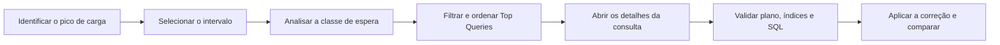

# OCI PostgreSQL Query Insights

<p align="center">
  
</p>

<p align="center">
  <strong>Monitore a carga, encontre gargalos e priorize a otimização das consultas PostgreSQL na OCI.</strong>
</p>

<p align="center">
  
  
  
  
</p>

## Visão geral

O **Query Insights** é o recurso nativo de observabilidade do OCI Database with PostgreSQL. Ele ajuda DBAs e desenvolvedores a entender a carga do banco, localizar consultas ineficientes e investigar gargalos por meio de métricas e visualizações integradas ao Console da OCI.

Com o painel, é possível responder rapidamente:

- quando a carga aumentou;
- quais classes de espera dominaram o período;
- quais consultas mais contribuíram para a carga;
- se o problema está relacionado a CPU, I/O, locks ou outro recurso;
- em qual banco, instância ou função (`Primary`/`Replica`) a consulta foi executada.

> Este guia em português foi elaborado a partir do artigo [Welcome to OCI PostgreSQL Query Insights](https://blogs.oracle.com/cloud-infrastructure/oci-postgresql-query-insights), publicado por Arvind Yadav em 22 de junho de 2026.

## Sumário

- [Principais recursos](#principais-recursos)
- [Pré-requisitos e acesso](#pré-requisitos-e-acesso)
- [Habilitar ou desabilitar](#habilitar-ou-desabilitar)
- [Entendendo o painel](#entendendo-o-painel)
- [Average Active Sessions](#average-active-sessions)
- [Análise das principais consultas](#análise-das-principais-consultas)
- [Fluxo prático de investigação](#fluxo-prático-de-investigação)
- [Interpretação das esperas](#interpretação-das-esperas)
- [Boas práticas](#boas-práticas)
- [Limitações e comportamento](#limitações-e-comportamento)
- [Referências](#referências)

## Principais recursos

| Recurso | Como ajuda |
| --- | --- |
| Average Active Sessions (AAS) | Mostra a intensidade da carga ao longo do tempo |
| Classes de espera | Indicam onde as sessões gastam tempo durante a execução |
| Top Queries | Destaca as consultas que mais contribuem para a carga |
| Filtros e pesquisa | Refinam a análise por consulta, banco, espera, instância e função |
| Drill-down | Exibe a decomposição das esperas de uma consulta específica |
| Ordenação | Prioriza consultas por AAS, quantidade de execuções ou tempo médio |

## Pré-requisitos e acesso

O Query Insights deve estar habilitado no DB System do OCI PostgreSQL. O acesso é controlado pelo IAM:

- usuários com permissão `write` ou `manage` no DB System podem visualizar e usar o recurso;
- usuários com acesso somente de leitura precisam da permissão:

```text
POSTGRES_DB_SYSTEM_INSIGHTS_READ
```

Adote o princípio do menor privilégio ao incluir essa permissão em uma política IAM e restrinja o escopo ao compartment ou aos recursos necessários.

## Habilitar ou desabilitar

### Novo DB System

Durante o provisionamento de um OCI PostgreSQL DB System, localize a opção **Query Insights** nas configurações do banco e habilite a coleta antes de concluir a criação.

### DB System existente

No Console da OCI:

1. acesse o serviço **OCI Database with PostgreSQL**;
2. selecione o DB System desejado;
3. abra as configurações do banco;
4. altere o estado do **Query Insights**;
5. confirme e aguarde a aplicação da configuração.

> **Atenção:** ao desabilitar o recurso, a coleta é interrompida e os dados existentes do Query Insights são removidos. Se ele for habilitado novamente, a coleta recomeça sem recuperar o histórico anterior.

## Entendendo o painel

O painel é dividido em duas áreas principais:

1. **Average Active Sessions over time (wait class):** apresenta a carga ao longo do tempo, agrupada por classe de espera.
2. **Top queries analysis:** relaciona as consultas que mais contribuíram para a atividade observada.

Essas visões devem ser usadas em conjunto: primeiro localize o intervalo e o tipo de espera; depois identifique as consultas responsáveis.



## Average Active Sessions

O **Average Active Sessions (AAS)** representa a média de sessões que estavam executando na CPU ou aguardando algum recurso durante a janela observada.

```text
AAS = tempo total das sessões ativas / duração da janela de observação
```

Exemplo: se uma consulta estiver presente em 60 amostras coletadas durante 60 segundos, sua contribuição será `AAS = 1,0`.

Use o gráfico para:

- comparar a carga em diferentes horários;
- localizar picos ou mudanças de padrão;
- separar atividade em CPU de sessões em espera;
- correlacionar o comportamento com deploys, jobs e tráfego da aplicação.

## Análise das principais consultas

A área **Top Queries** permite pesquisar ou filtrar pelos seguintes atributos:

| Filtro | Uso recomendado |
| --- | --- |
| Query | Localizar um padrão ou trecho do SQL |
| Database name | Isolar a carga de um banco específico |
| Wait event types | Investigar CPU, I/O, locks e outras esperas |
| DB instance ID | Analisar uma instância específica |
| Role | Separar atividade do `Primary` e das `Replicas` |

As consultas podem ser ordenadas por:

- **Average Active Sessions:** encontra quem mais contribui para a carga;
- **Query Count:** destaca SQLs executados com muita frequência;
- **Mean Execution Time:** prioriza consultas lentas por execução.

Ao expandir uma consulta, examine a distribuição do tempo por tipo de espera. Uma consulta com tempo médio alto pode ter causas diferentes de outra executada milhares de vezes; a ação de tuning deve considerar impacto total, frequência e experiência do usuário.

## Fluxo prático de investigação

1. Selecione a janela em que a lentidão foi percebida.
2. Localize o pico no gráfico de AAS.
3. Identifique a classe de espera predominante.
4. Filtre **Top Queries** pela mesma espera.
5. Ordene por AAS em ordem decrescente.
6. Abra a consulta que mais contribui para a carga.
7. Compare quantidade de execuções, tempo médio e decomposição das esperas.
8. Analise o plano de execução no banco:

```sql
EXPLAIN (ANALYZE, BUFFERS)
SELECT ...;
```

> `EXPLAIN ANALYZE` executa a consulta. Avalie o impacto antes de usá-lo em produção, especialmente com comandos que alteram dados ou consultas de alto custo.

9. Verifique índices, estimativas de cardinalidade, leituras, joins e contenção.
10. Aplique a correção de forma controlada e compare o mesmo perfil de carga.

## Interpretação das esperas

| Classe | Interpretação comum | Primeiras verificações |
| --- | --- | --- |
| CPU | Processamento, joins ou cálculos intensivos | Plano, cardinalidade, índices e volume processado |
| IO | Espera por leitura ou escrita | Scans extensos, cache, índices e armazenamento |
| Lock | Sessão bloqueada por outra transação | Blocking sessions, transações longas e ordem de acesso |
| LWLock | Contenção interna em estruturas de memória | Concorrência, padrão de acesso e versão do PostgreSQL |
| Client | Banco aguardando o cliente | Rede, aplicação, pool de conexões e consumo do resultado |
| IPC | Coordenação entre processos | Paralelismo e comunicação entre workers |
| BufferPin | Buffer compartilhado indisponível | Concorrência sobre páginas ou objetos específicos |
| Timeout | Espera temporizada | `pg_sleep`, timeouts e comportamento da aplicação |
| Activity / Extension | Processos internos ou extensões | Atividade de background e extensões instaladas |

Uma classe de espera é uma pista, não um diagnóstico completo. Confirme a hipótese com o plano de execução, métricas do DB System, logs e contexto da aplicação.

## Boas práticas

- acompanhe o AAS regularmente para conhecer a linha de base do ambiente;
- investigue picos dentro do contexto de tráfego, deploys e tarefas agendadas;
- priorize pelo impacto total, não apenas pelo maior tempo de uma execução;
- correlacione classes de espera com recursos do DB System;
- revise consultas frequentes, índices e planos de execução;
- compare tendências ao longo do tempo em vez de depender de uma captura isolada;
- registre a janela, a hipótese, a alteração e o resultado de cada tuning;
- complemente o Query Insights com alarmes e notificações da OCI.

## Limitações e comportamento

Segundo o artigo de referência:

| Item | Comportamento informado |
| --- | --- |
| Retenção | Até 7 dias |
| Armazenamento | No próprio DB System, no banco `oci_admin` |
| Custo adicional | Não há cobrança adicional pelo recurso |
| Reativação | Inicia uma nova coleta; o histórico removido não retorna |

Como características de serviços em nuvem podem mudar, confirme limites, disponibilidade regional e comportamento atual na documentação oficial antes de definir processos operacionais ou requisitos de auditoria.

## Referências

- [Welcome to OCI PostgreSQL Query Insights — OCI Blog](https://blogs.oracle.com/cloud-infrastructure/oci-postgresql-query-insights)
- [OCI Database with PostgreSQL — documentação oficial](https://docs.oracle.com/en-us/iaas/Content/postgresql/home.htm)
- [Métricas do OCI Database with PostgreSQL](https://docs.oracle.com/en-us/iaas/Content/postgresql/metrics.htm)
- [PostgreSQL: Using EXPLAIN](https://www.postgresql.org/docs/current/using-explain.html)

---

Este repositório é um material educacional independente e não representa documentação oficial da Oracle. Oracle, Java e MySQL são marcas registradas da Oracle Corporation e/ou de suas afiliadas. PostgreSQL é uma marca registrada da PostgreSQL Community Association of Canada.
